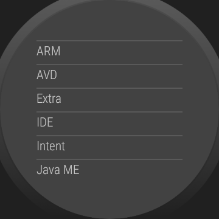
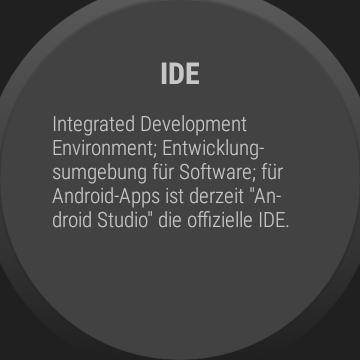

# WearOS-App: "Glossar"

Android-Studio-Project for a WearOS-App which represents a simple glossary for terms
in the area of Android programming; supports only German language.

 

----
## Screenshots

Screenshots were taken from emulator.

 

----
# License

See the [LICENSE file](LICENSE.md) for license rights and limitations (BSD 3-Clause License).